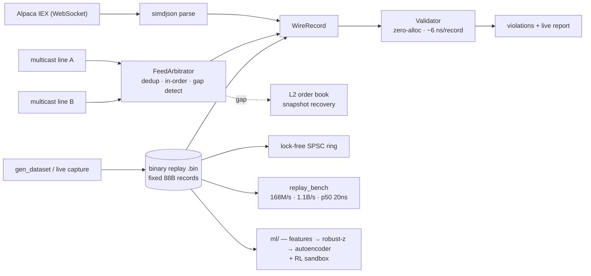

# ohlcv-validator

[](https://github.com/GSAPify/ohlcv-validator/actions/workflows/ci.yml)


A low-latency C++20 market-data pipeline built to HFT engineering standards — not a
data-quality script. It ingests live and exchange-style feeds, validates on a
zero-allocation hot path, reconstructs an order book from a redundant multicast
feed, and carries an honest ML layer on top. **Every correctness claim has a test;
every performance claim, a measurement.**

```
validate    ~6 ns / record      zero allocations, proven by a test (not asserted)
throughput  ~1.1 B rec/s (24c)  ~168 M/s single core
latency     p50 20 ns · p99 30 ns · p99.9 40 ns      (x86, rdtscp)
hardening   136 tests · ASan/UBSan/TSan clean · 1.9 M fuzzed parser inputs, 0 crashes
```

### Quickstart

```sh
brew install cmake ninja boost simdjson spdlog nlohmann-json googletest
cmake -S . -B build -G Ninja -DCMAKE_BUILD_TYPE=Release && cmake --build build
ctest --test-dir build                                          # the C++ test suite
./build/gen_dataset data/replay.bin 1000000 && ./build/replay_bench data/replay.bin 100
```

### Architecture



## Goal

Validate live OHLCV market data **on the hot path** — zero heap allocations,
~6 ns per record on a single core — not a research-grade data-quality script.
The bar I hold it to: every correctness claim is backed by a test, and every
performance claim by a reproducible measurement, framed honestly.

## Why this exists

Most "market data validators" are FastAPI services querying daily bars from Polygon. That solves a different problem (data quality for research) using a stack that does not transfer to low-latency engineering interviews. This project deliberately targets the *engineering* skills HFT and market-making firms hire for: cache-aware design, allocation-free hot paths, and measured throughput.

## Engineering decisions

The decisions matter more than the feature list:

- **Binary over JSON for the measured path.** A live JSON websocket (Alpaca IEX) is included as a "runs on real data" demo — but timing socket-to-validation on JSON measures the parser and the network, not market-data handling. Real venues ship fixed-layout binary messages (ITCH/SBE-style), so the benchmark reads a fixed-stride record straight out of an `mmap`'d file by cast: no parse, no copy, no allocation.
- **Throughput, framed honestly.** ~167 M records/sec on one core, steady from 1M to 10¹⁰ validations. It is deliberately *not* reported as a latency distribution: per-record cost is below the ~41 ns Apple-Silicon clock floor, so p50/p99 there would be timer noise. The latency distribution itself is measured on x86 with `rdtscp` (see Benchmark) — p50 20 ns / p99 30 ns on a Ryzen 9 7900X3D.
- **Claims are proven, not asserted.** "Zero allocations on the hot path" is a test (`tests/test_alloc_guard.cpp` overrides global `operator new` and fails on any allocation), not a sentence in a README.
- **Reconstruction with tolerance, not `==`.** The cross-record check — do a bar's constituent trades rebuild its volume, VWAP, and OHLC? — uses a relative tolerance, because real feeds round prices to a tick and exact equality would false-positive on every live bar.

## Status

`v0.1.0` — live JSON ingest + a zero-allocation validator measured over a binary
replay path.

```
line A ┐                                                  exchange-style feed:
line B ┴► FeedArbitrator ──► WireRecord ──► Validator      A/B arbitration, in-order
  (seq'd packets,  dedup, in-order release,               release, gap detection
   redundant)      gap detection (zero-alloc)             ← "real feeds" path

Alpaca IEX ──ws──► parse ──► [→ Wire] ──► Validator ──► live violation report
                                                          ← runs on real ticks
                                                            (validates, not just parses)

binary file ──mmap──► WireRecord ──► Validator ──► throughput
  (fixed-layout POD,    no parse,     zero alloc      ~167M rec/s
   ITCH/SBE-shaped)     no copy       after ctor)     ← the measured path

binary file ──► [decode thread] ──push──► SPSC ring ──pop──► [validate thread]
                                          (lock-free,                  ← pipeline
                                           cache-line aware)             (x86)

binary file ──► ml/ (Python) ──► features ──► robust-z baseline ──► scores
  (same .bin,    NumPy reader     per-symbol     (rung 2)            ← ML layer
   zero-copy)    mirrors wire.h   bar features ──► autoencoder ──► scores  (offline)
                                                   (rung 3, torch)
```

The C++ side is the fast data plane; `ml/` is an offline Python layer that learns
from the *same* binary file (no second serialization path). It reads trades+bars
into NumPy and runs a **model ladder** — a robust-z baseline (rung 2) and an
autoencoder (rung 3), each rung justified only by beating the one below. The
autoencoder is shown catching a **rule-invisible** anomaly (a return↔volume
correlation break) that both the validator and the baseline miss — a mechanism
demo, not a field-performance claim. A separate **position-taking RL sandbox**
(`ml/rl_env.py`) runs on the same feature stream, with a no-lookahead proof
(a cheating policy profits; obs-only policies can't) — mechanics only, no trained
agent. Both rungs are evaluated **leakage-free**: a time-ordered fit→calibrate→test
split (no random shuffle of a time series) with **calibrated, data-driven
thresholds** instead of a textbook σ — and that rigor reveals the random-split AUC
(0.997) was inflated by lookahead (~0.83–0.98 under the honest split). See
[`ml/README.md`](ml/README.md) for the head-to-head and for why the order-book
deep-learning literature (Sirignano 2016) doesn't fit this feed.

### Feed handler — A/B arbitration + gap detection

Real exchange feeds aren't a single WebSocket: the venue publishes one
sequence-numbered binary stream redundantly on two lines (A and B) over UDP
multicast, and the receiver must reconstruct the true stream. `src/feed/` is that
core: `FeedArbitrator` (`feed/arbitrator.h`) consumes sequenced packets from both
lines and **delivers every sequence exactly once, strictly in order**, taking
whichever line is first, while **detecting genuine gaps** (a sequence lost on
*both* lines). It gets the two things a naïve handler botches right: it doesn't
declare a gap on mere reordering (it buffers a reorder window and releases the
contiguous prefix), and its power-of-two seq-indexed ring stores and validates the
sequence per slot so a far-ahead jump can't alias a live message. Zero-alloc on
the packet path (alloc-guard tested), payload is the same `WireRecord`. This is
arbitration + gap *detection*, not recovery — a detected gap is the hook where a
real system requests a retransmit or replays a snapshot; the gap signal is what
the order-book builder (next) needs, since a book is invalid until snapshot
recovery while a trade stream tolerates a skip.

The **multicast transport** wires this to real sockets (`feed/udp_multicast.h`):
`feed_publisher` is an "exchange" publishing one sequenced stream redundantly to
two multicast groups (with configurable per-line drop), and `feed_handler` joins
both, drains them single-threaded, arbitrates, and validates the reconstructed
stream. Proven by a deterministic loopback integration test
(`tests/test_feed_multicast.cpp`, single-line drop covered by the other line; a
both-line drop is the one gap). The test is built but kept out of CI (multicast
isn't guaranteed on runners) — run it locally. The live demo's *throughput* is
environment-dependent: a high-rate burst on macOS multicast loopback shows
nondeterministic socket-level loss (confirmed via `netstat -s -p udp`: "dropped
due to full socket buffers"), so the publisher is paced; on Linux it's reliable.

### Order book — L2 builder with snapshot recovery

`src/book/` builds an aggregated (L2) limit order book from a sequenced delta
stream — the structure real strategies (and the order-book ML literature) operate
on, the thing OHLCV/top-of-quote can't give you. `OrderBook` keeps the best levels
per side (zero-alloc, best-at-front); `BookBuilder` is the part that matters: a
`Recovering ↔ Live` state machine that makes the order book's defining hard
requirement explicit — **a lost update invalidates the whole book until a snapshot
rebuilds it** (a trade stream tolerates a skipped sequence; a book can't, because
every delta mutates state later deltas depend on). This is where #1a's exact gap
detection earns its keep.

The subtle, load-bearing part is the **recovery race**: a snapshot is generated
asynchronously while deltas keep flowing, so it's "correct as of seq N" while you
may have already buffered N+1…N+5. Correct recovery discards buffered deltas with
seq ≤ N (already in the snapshot) and replays only seq > N — re-applying one
double-counts, dropping one leaves a hole — and rejects a too-old snapshot that
can't close the gap, waiting for a newer one rather than building a corrupt book.
The proof isn't a label: a test reconstructs a gapped stream via snapshot recovery
and asserts the result is **byte-identical** to a from-scratch build of the same
deltas. (L2 here; L3 per-order is a follow-up. Book building is the control plane,
so the level bookkeeping is O(levels), not the ns hot path — deliberately.)

## Benchmark

Decode+validate, single core, 1M-record dataset, 200 passes (`replay_bench`),
on Apple Silicon (M-series).

```
throughput:  ~167 M records / sec
mean:        ~6 ns / record   (allocation-free hot path)
```

(The per-trade reconstruction accumulator — running on every trade — is what
moved this from the ~2 ns/record of the bounds-only validator; still allocation-
free, the work is just real now.)

That M-series figure is **throughput** (batched per-pass) — per-record cost is
below the ~41 ns Apple-Silicon clock floor, so a per-record *tail* can't be
measured there. For that, the bench runs on x86.

### Latency distribution — x86 (`rdtscp`)

Ryzen 9 7900X3D (4.4 GHz invariant TSC), single core pinned with `taskset`, each
decode+validate timed with one `rdtscp` pair (timer overhead measured and
subtracted), 5M samples (`replay_bench_rdtsc`):

```
p50  20 ns   ·   p99  30 ns   ·   p99.9  40 ns   ·   p99.99 ~200 ns   ·   mean ~17 ns
```

Stable to p99.9 across runs. This is per-event, `lfence`-serialized latency (the
point-in-time metric) — higher than the amortized throughput above because
serialization defeats pipelining.

The far tail (p99.99 ~200 ns, max tens of µs) is the **WSL2 virtualization layer,
not normal-task preemption** — and I measured that rather than assuming it: pinning
plus `SCHED_FIFO` real-time scheduling (`chrt -f`) leaves p99.99 and max
*unchanged*, so raising scheduling priority doesn't help. The tail is the Hyper-V
host descheduling the VM's vCPU. Collapsing it needs a genuinely isolated core
(`isolcpus`/`nohz_full`) on bare metal, which WSL2 can't fully provide. The core
distribution (p50–p99.9) is what the validator actually controls, and it's tight.

### Multicore scaling — x86, 24 threads

Shard-by-symbol across the 7900X3D's 24 threads (`replay_bench_mt`):

```
 1c 93 M/s   2c 2.2×   4c 3.9×   8c 6.4×   10c 9.5×   14c (dip)   24c ~12× → ~1.1 B records/sec
```

Near-linear to ~10 cores, then memory bandwidth and the chip's dual-CCD / 3D
V-cache asymmetry taper it (a reproducible dip at 14 threads, as work spills
across both chiplets). Peak ≈ **1.1 billion records/sec**, single machine
(reconfirmed). The per-core and speedup magnitudes wander run-to-run on a
non-isolated WSL2 host; the shape (near-linear early, chiplet dip, ~1 B peak) is
stable.

### Pipeline — lock-free SPSC ring (x86)

A single-producer/single-consumer ring (`src/concurrent/spsc_ring.h`) decouples a
decode thread from a validate thread — the structure every real feed handler has.
At IEX volume one thread copes fine; this isn't load-bearing. It's here to make
the thread-to-thread handoff measurable, and to settle a cache-line question with
data instead of lore.

Correctness first: the threaded 1M-item strict-FIFO test
(`tests/test_spsc_ring.cpp`) passes under ThreadSanitizer (`-DSANITIZER=thread`),
so the acquire/release pairing is *proven* race-free — no drops, dups, or
reordering — not just argued.

Ring-bound throughput (the consumer does no work, so the cursors are the
bottleneck), median of 5, producer and consumer pinned to two cores of one CCD:

```
payload      cursors on separate lines     cursors packed on one line
64B record       ~33 M ops/s                   ~44 M ops/s    (packed ~+22%, steady)
8B word         ~185 M ops/s                  ~205-245 M ops/s (packed faster, +8-26%)
```

These are off a WSL2 host with no core isolation, so the magnitudes wander run to
run — the 64B delta sits steadily around +22%, the 8B one swings between roughly
+8% and +26%. What's robust across every run is the **sign**: packing wins. (Bare
metal with `isolcpus` would tighten the numbers; the direction wouldn't change.)

The surprise: **packing the two cursors onto one cache line is faster** — and the
textbook rule is to pad them *apart* to avoid false sharing. My read of why this
ring inverts that: it re-reads *both* cursors every iteration — the producer checks
`head` to see if the ring is full, the consumer checks `tail` to see if it's empty
— so the cursors are *truly* shared, not falsely. On one line a single cross-core
transfer carries both updates; split across two lines, both lines bounce every
item. The "pad your cursors" advice assumes the production optimization — each side
*caches* the far cursor and re-reads it only when its cache says full/empty.

So I built that (the `CacheFarCursor` variant) and measured whether it flips the
result. It **half** did, which is the honest and more interesting outcome:

```
64B record (median of 5, 4 separate runs)   separate    packed     packed wins by
naive  ring (re-reads both cursors)          ~33 M/s    ~44 M/s        ~23%  (stable)
cached ring (caches the far cursor)          ~43 M/s    ~47 M/s        ~9%   (stable)
```

Caching **raised throughput ~30%** (separate-lines 64B, ~33→43 M ops/s) — as
predicted, eliminating most cross-core cursor reads. And it **shrank** packing's
lead from ~23% to ~9%, exactly the direction the true-sharing story predicts (less
cursor traffic → cursor placement matters less). But it did **not flip** the sign:
packed still wins. So padding the cursors is *still* the wrong call for this design
even with the textbook optimization applied — the true-sharing mechanism is part of
the story, not all of it. (8B-word runs are too noisy on this WSL host to quote a
delta, but packed won there in every run too.) I'd rather ship that than a clean
story the data doesn't support.

Realistic pipeline (the consumer validates each record): the producer is a 64-byte
`mmap` copy, so it outruns the validator and the ring sits ~95% full. End-to-end
throughput is validate-bound (~19 M rec/s), and the enqueue→dequeue "latency" is
therefore *queue residency* (ring depth × consume time ≈ 50 µs), not the ring's
sync cost — the bench prints mean ring occupancy so which regime you're in is
explicit, never implied.

The hot path is allocation-free, and that's *proven*, not asserted:
`tests/test_alloc_guard.cpp` overrides global `operator new` and requires zero
heap allocations through a 100k-record validate stream.

The validator catches non-positive prices, inverted OHLC bands, out-of-band
VWAP, volume/trade-count inconsistency, per-symbol timestamp regressions,
dropped-message sequence gaps, bars whose constituent trades fail to reconstruct
their volume/count/VWAP/OHLC (the cross-record check), quote anomalies
(crossed/locked book, non-positive or zero-size sides), and per-symbol
price-band outliers: trades or quote mids that deviate more than 5% from a
per-symbol EWMA reference are flagged; outliers are excluded from the EWMA so
one bad tick cannot shift the band for subsequent records.

### Live validation

The same validator now runs **inline on the live Alpaca feed**, not just the
binary replay: `alpaca_ingest` adapts each parsed trade, **quote**, and bar to the
wire types (`src/ingest/to_wire.h`) and validates it as it arrives, printing a
per-symbol flag inline and a violation summary on exit. So "runs on real data" now
means it *validates* real data, not merely parses it.

It runs as a tool, not just a demo: symbols are command-line args
(`alpaca_ingest AAPL MSFT NVDA`; one symbol prints every record, many go quiet and
show only violations + summary), and setting `OHLCV_VIOLATIONS_LOG=path` writes
each flagged record as a structured **JSONL** line (`src/ingest/violation_log.h`)
— machine-readable for downstream tooling (and the eventual feature stream). Two
schema choices worth noting: it logs only the *surfaced* checks (suppressed ones
stay out, same as the live `!!` output), and 64-bit nanosecond timestamps are
emitted as JSON **strings** so `jq`/JS doubles don't silently truncate them.

Setting `OHLCV_CAPTURE=path` records the full validated stream to the **binary
replay format** (`src/replay/capture_writer.h`) — the same fixed-stride layout
`gen_dataset` synthesizes. That closes the loop the README opened: the benchmark
and validator can now run on *captured real market data*, not just a synthetic
dataset, and the same file is the raw material for the eventual ML training set.
(It stores the real `ts_ns` but a synthetic per-symbol `seq`, so it's a replay
artifact, not a faithful raw-feed archive; a hard kill before clean shutdown
leaves the header count unpatched.)

Quotes carry the order-book checks trades and bars can't express — **crossed**
(bid > ask) and **locked** (bid == ask) books, non-positive or zero-size sides, and
**quote-mid outliers** against the per-symbol EWMA reference — and they arrive ~an
order of magnitude more often than trades. What they add is **coverage, not noise**:
those checks now run on live data, where order-book anomalies *would* surface. They
don't make the stream chatty — IEX is a *single venue*, and one matching engine
won't post a crossed or locked book against itself (crossed/locked is really an
NBBO-across-venues phenomenon), so on clean IEX data the quote checks stay as quiet
as the rest. The win is that the checks run, not that they fire.

Honest caveats, because the feed shapes what's meaningful:

- **A correctness validator on clean vendor data is supposed to be quiet.** Alpaca
  won't send negative prices, inverted bands, or (single-venue) crossed books, so
  on a healthy stream the value checks mostly pass; a `!!` flag means a genuinely
  odd tick. Silence is the expected result — and the catch logic is *proven* on
  bad-shaped data offline (`tests/test_live_validation.cpp` drives the real
  Parser→adapt→Validator chain, no network or keys needed). I have not run this
  live (claims here are from the offline tests, not an observed live session).
- **Reconstruction and sequence-gap detection are N/A on the IEX sample.** IEX is
  a few percent of consolidated volume, so our trades can't rebuild Alpaca's
  full-market bars; and the JSON carries no per-feed sequence number to diff (the
  live path assigns a per-symbol monotonic `seq`, which makes gap detection
  structurally inert rather than falsely clean).
- **Timestamp regression is correct now, but still suppressed live — for a
  narrower reason.** The validator tracks a **per-stream `last_ts`** (trade /
  quote / bar each), so the old cross-stream false-flagging — a quote advancing
  one shared clock and tripping a following trade — is fixed; monotonicity is
  checked *within* a stream, where it belongs. (This makes the check correct for
  *any* multi-stream dataset; the current binary generator happens to emit
  monotonic-across-type timestamps, so there's no observed binary-path change —
  it still flags 756 injected regressions per run, same as before. The payoff is
  the live un-suppression below.) The check stays suppressed on the *live* report
  for the remaining reason
  that it's unverified on real delivery: IEX event timestamps arrive over a
  websocket with no monotonic-delivery guarantee, and same-timestamp or
  sub-microsecond-reordered ticks within one stream could flag benign regressions.
  Un-suppressing is gated on a live measurement (count how often it actually fires
  on real frames), not on more reasoning.

Next step: that live measurement — capture real frames and see whether
within-stream timestamp regression fires on benign jitter before un-suppressing it.

**Resilience.** The first real live run surfaced a concrete gap: on an idle feed
the read blocked forever and couldn't be interrupted — Beast's client default is
no idle timeout and no keep-alive pings, so a quiet or silently half-open peer
parks `read()` indefinitely. The client now sets a finite `idle_timeout` +
keep-alive pings (dead peers surface as a timeout) and, on any drop, **reconnects
transparently** — reconnect → re-auth → replay the stored subscription, with
exponential backoff (`src/util/backoff.h`, the ceiling unit-tested; jitter on
top). The validation loop is untouched: it just sees the reconnect's ack frames
again. The reconnect is **integration-tested**, not just asserted:
`tests/test_reconnect.cpp` stands up a local TLS websocket server, drops a live
connection mid-stream, and proves the *unmodified* client re-establishes
(reconnect → re-auth → re-subscribe) and resumes — no Alpaca, no market hours
(the test trusts the server's self-signed cert via `SSL_CERT_FILE`, so the client
needs no test seam). The backoff ceiling is separately unit-tested.

Remaining caveat: interrupting a *live-but-idle* feed instantly still needs the
deferred async refactor (keep-alive pings keep an alive connection's read blocked,
so a stop flag checked in `read_frame` is never reached — confirmed live). It's a
low-severity, off-hours-only annoyance; the fix is `asio::signal_set` cancelling
the in-flight read on signal.

## Build

```
cmake -B build -G Ninja -DCMAKE_BUILD_TYPE=Release
cmake --build build
./build/ohlcv_validator
```

## Test

```
ctest --test-dir build --output-on-failure
```

## Runbook

See [`docs/runbook.md`](docs/runbook.md) for all build/run/test commands and an activity log.

## Platform notes

Developed on Apple Silicon (M-series), where the user-space cycle counter is virtualized at 24 MHz (~41 ns) — fine for throughput, too coarse for a per-record latency tail. The latency distribution is therefore measured on a Linux x86_64 host (Ryzen 9 7900X3D, WSL2) with an invariant TSC read via `rdtscp`. The Mac is the development environment; the x86 box is the measurement environment.
